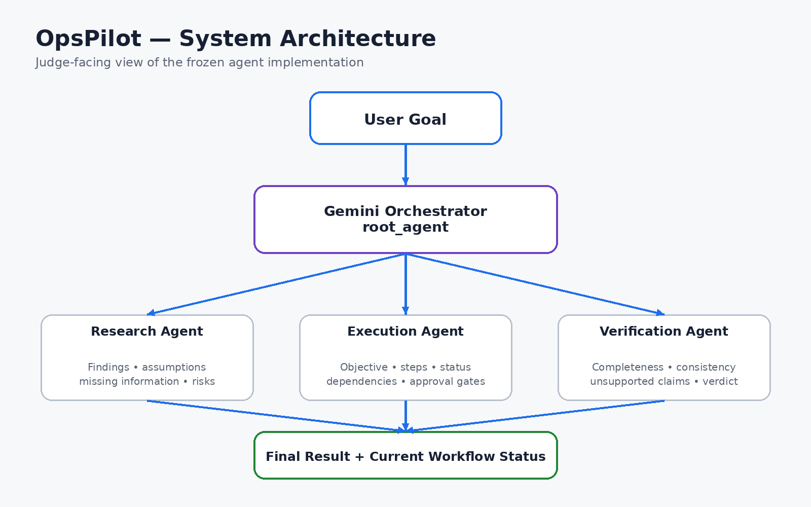
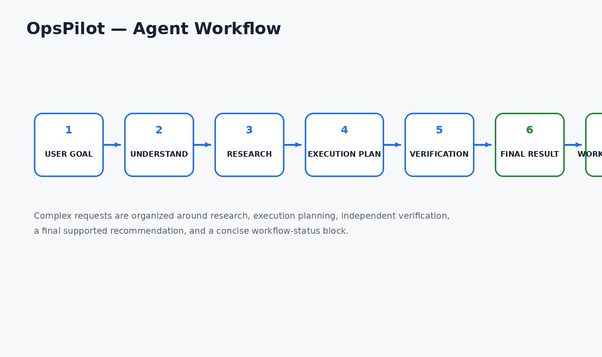
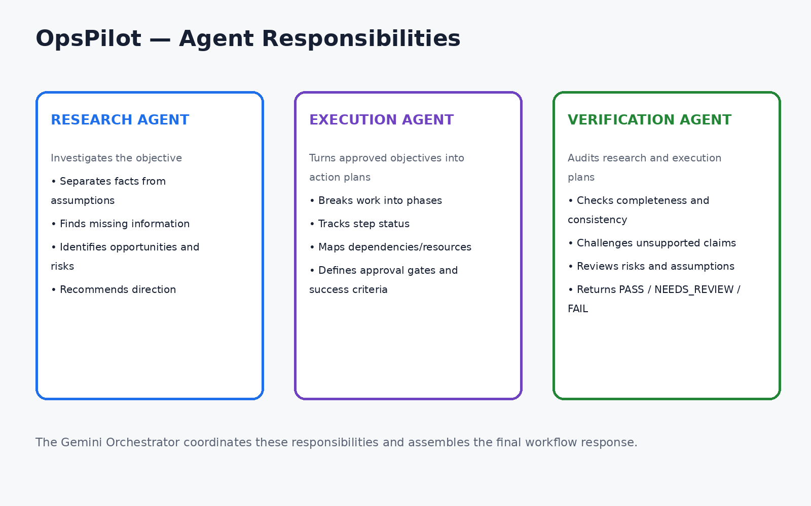
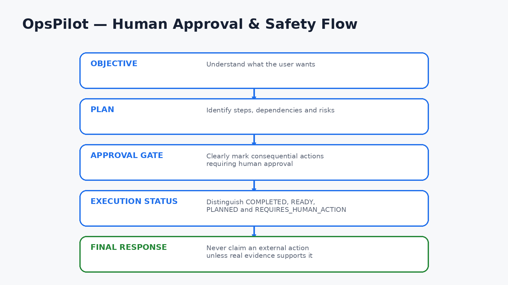

# OpsPilot

> A Gemini-powered multi-agent workflow system for turning complex user objectives into structured research, execution planning, independent verification, and transparent workflow status.

## Overview

OpsPilot is built around a central **Gemini Orchestrator** and three specialist agents:

- **Research Agent** — investigates objectives, separates facts from assumptions, identifies missing information, opportunities, and risks.
- **Execution Agent** — converts an approved objective into a practical step-by-step plan with dependencies, resources, status, human approval gates, and measurable success criteria.
- **Verification Agent** — independently audits the research and execution plan for completeness, consistency, unsupported claims, feasibility, and risk.

The orchestrator coordinates the workflow and produces a final result together with a concise workflow-status block.

## Architecture



The architecture mirrors the frozen implementation: a Gemini-powered root orchestrator coordinates the three specialist agents and combines their work into the final workflow response.

## Agent Workflow



For complex requests, OpsPilot organizes work around:

1. Understanding the user's goal
2. Research
3. Execution planning
4. Independent verification
5. Final result
6. Current workflow status

Simple conversational requests are intentionally handled without forcing an unnecessarily large workflow.

## Agent Responsibilities



### Research Agent

The Research Agent investigates the user's objective and returns:

- Research findings
- Important assumptions
- Missing information
- Opportunities
- Risks
- Recommended direction

### Execution Agent

The Execution Agent converts an objective and available research into an actionable plan covering:

- Objective
- Prioritized steps and status
- Dependencies
- Resources
- Expected outputs
- Blockers and risks
- Human approval gates
- Definition of successful completion

### Verification Agent

The Verification Agent independently reviews the work and classifies it as:

- `PASS`
- `NEEDS_REVIEW`
- `FAIL`

It checks whether the objective was addressed, whether assumptions and risks are visible, whether the execution plan follows logically from the research, and whether claims are supported.

## Human Approval & Safety



A core design principle is **honest execution state**.

OpsPilot is instructed not to claim that an external action happened unless a real tool performed it. Consequential actions are explicitly identified as requiring human approval.

Execution steps can be marked:

- `COMPLETED`
- `READY`
- `REQUIRES_HUMAN_ACTION`
- `PLANNED`

This makes the system's boundary between planning, completed work, and human-controlled action explicit.

## Current Workflow Status

Complex workflow responses finish with a concise status block:

- **Research:** `COMPLETED` / `IN_PROGRESS` / `REQUIRES_REVIEW`
- **Execution Plan:** `COMPLETED` / `PLANNED` / `REQUIRES_HUMAN_ACTION`
- **Verification:** `COMPLETED` / `IN_PROGRESS` / `NEEDS_REVIEW`
- **Overall Status:** `READY` / `BLOCKED` / `NEEDS_HUMAN_INPUT` / `COMPLETE`
- **Next Action:** the single most important next step

## Technology

- Python
- Google Agent Development Kit (ADK)
- Gemini model: `gemini-3.6-flash`
- `google-genai` types for retry configuration
- `uv` for Python dependency management
- Local ADK web server for development/testing

## Project Structure

```text
opspilot/
├── app/
│   ├── agent.py
│   ├── agent.backup.py
│   ├── app_utils/
│   │   ├── a2a.py
│   │   └── services.py
│   ├── fast_api_app.py
│   └── __init__.py
├── docs/
│   ├── architecture.png
│   ├── workflow.png
│   ├── agent-responsibilities.png
│   └── human-approval-flow.png
├── tests/
│   ├── eval/
│   ├── integration/
│   └── unit/
├── GEMINI.md
├── agents-cli-manifest.yaml
├── Dockerfile
├── pyproject.toml
└── README.md
```

## Local Development

The project was tested locally through the ADK web interface.

After activating the project environment, the local development server can be started with:

```bash
adk web
```

The ADK web server exposes the local development interface at:

```text
http://127.0.0.1:8000
```

Stop the local server with `Ctrl+C`.

## Development Notes

The main implementation lives in `app/agent.py`.

The root agent is an ADK `Agent` configured as the Gemini Orchestrator. The three specialist agents are also ADK agents and are registered as sub-agents of the root agent.

The implementation uses retry configuration for Gemini requests through:

```python
types.HttpRetryOptions(attempts=3)
```

## Design Principles

### 1. Research before execution

Complex objectives should first be investigated so assumptions, missing information, opportunities, and risks are visible.

### 2. Explicit execution state

The system distinguishes planning from completed work and identifies actions requiring human involvement.

### 3. Independent verification

Verification is treated as a separate responsibility rather than assuming that the initial plan is correct.

### 4. No fabricated actions or evidence

The agents are explicitly instructed not to invent facts, sources, statistics, actions, results, or evidence.

### 5. Human approval for consequential actions

The system makes human approval gates explicit whenever a consequential decision or external action is required.

## Evaluation & Testing

The repository includes evaluation, integration, and unit-test areas under `tests/`.

The local ADK web environment was used to exercise the application during development. The repository should be evaluated using the included tests and the configured ADK tooling before any production deployment.

## Project Status

**Implementation:** Frozen for submission

**Documentation:** Submission-ready

**Architecture:** Documented

**Repository:** Public GitHub repository

## Repository

GitHub: https://github.com/princeakpabio8-prog/opspilot

## Submission Notes

OpsPilot is designed to demonstrate a structured multi-agent workflow rather than a single prompt-response agent. Its key contribution is the explicit separation of:

**Research → Execution Planning → Verification → Transparent Status**

The architecture and documentation are intentionally aligned with the implementation in `app/agent.py`.
